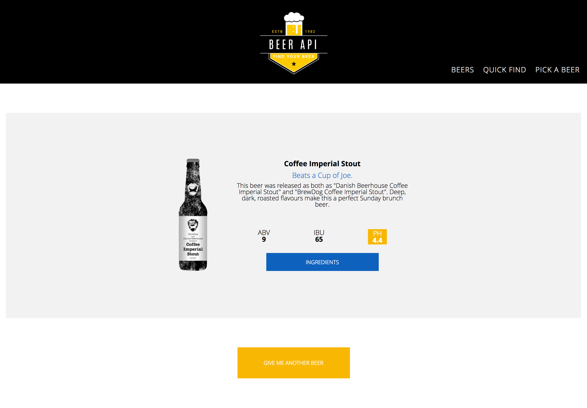

## Instanews

This project consisted of creating a listing of beers from the BrewDog Punk API. 

## Personal Learning

I have really enjoyed this project. My knowledge of jQuery and Javascript is getting stronger. It's still hard to know what documentation to use but once I know which one to use, I feel more confident when coding. I have tried to use more SASS features inncluding more extends. 

For the Javascript, I have been able to use import/export by creating classes. For this project I was able to use Ajax and postman to get the information I needed with better understanding. 

## Tools and Technologies

HTML, Sass, Gulp, Javascript, jQuery.

## Screenshots

## Random Beer

## Pick a Beer

